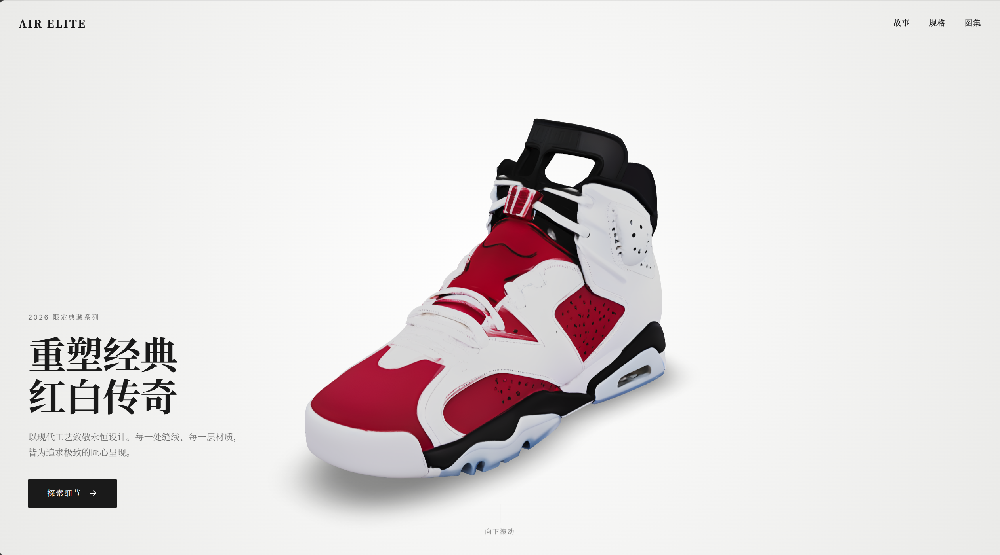
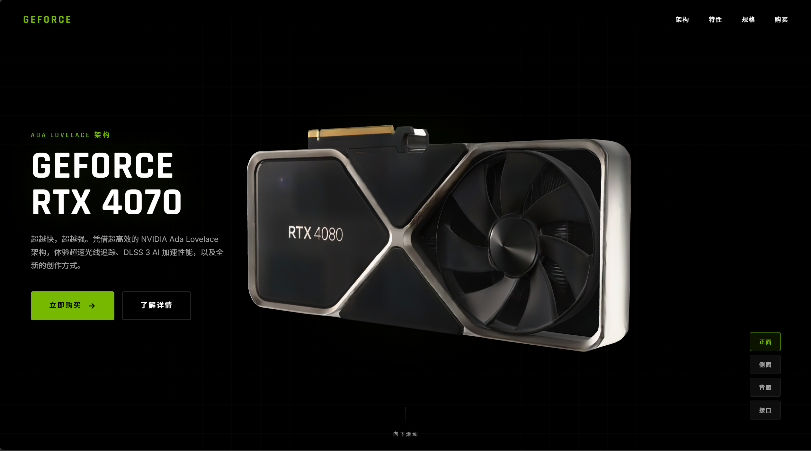
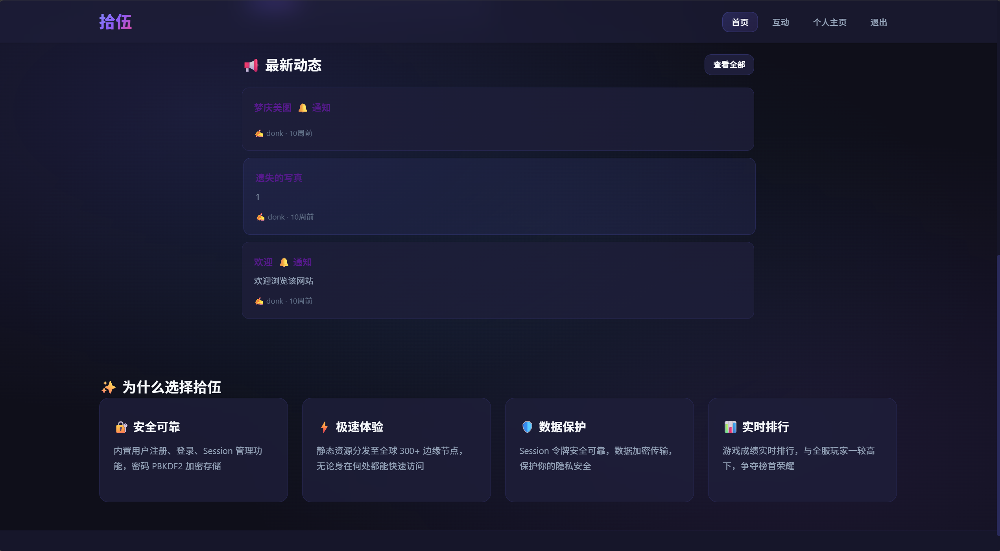

# Design Skills for Claude Code

一套专业级 Claude Code 设计技能包，让你的 AI 助手变身为资深 UI/UX 设计师。

> A professional Claude Code skill pack that turns your AI assistant into a senior UI/UX designer.

---

## 🎯 效果展示 / Showcase

### 使用技能后的效果 / After Using This Skill

**科技产品落地页 / Tech Product Landing Page**



**品牌产品页 / Brand Product Page**



### 未使用技能 vs 使用技能 / Without Skill vs With Skill

**没有设计规范的原始页面 / Original page without design guidelines**



**应用技能后的专业设计 / Professional design after applying the skill**


> 💡 差异对比：左侧是普通 AI 生成的页面，右侧是应用 Design Skills 后的专业设计。注意排版层级、配色系统、间距节奏和整体视觉品质的显著提升。
>
> 💡 Contrast: Left is a typical AI-generated page; right is the same concept after applying Design Skills. Notice the dramatic improvement in typography hierarchy, color system, spacing rhythm, and overall visual quality.

---

## 📦 包含技能 / Included Skills

| 技能 / Skill | 描述 / Description |
|------|------|
| [ui-designer](./ui-designer/) | 专业 UI/UX 设计师 — 自动市场调研 + 完整设计方案 + 代码实现 / Professional UI/UX Designer — auto market research + complete design system + code implementation |

---

## 🚀 快速开始 / Quick Start

### 安装 / Installation

将此仓库克隆到你的 Claude Code 技能目录：

Clone this repo into your Claude Code skills directory:

```bash
# 克隆到 skills 目录 / Clone into skills directory
cd ~/.claude/skills
git clone https://github.com/ccwbb78/design-skills.git
```

或者手动下载 / Or manually download:

1. 下载此仓库的 ZIP 文件 / Download the ZIP from this repo
2. 解压 / Extract
3. 将 `ui-designer` 文件夹复制到 `~/.claude/skills/` / Copy the `ui-designer` folder to `~/.claude/skills/`

### 使用 / Usage

在 Claude Code 中直接描述你的设计需求，技能会自动激活：

Simply describe your design needs in Claude Code — the skill activates automatically:

```
# 中文示例 / Chinese Examples
"帮我设计一个科技产品的落地页"
"设计一个 SaaS 产品的定价页面"
"我需要一个暗色风格的个人作品集网站"

# English Examples
"Design a landing page for a tech product"
"Create a pricing page for a SaaS product"
"I need a dark-themed personal portfolio website"
```

Claude 会自动执行以下流程：

Claude automatically executes this workflow:

1. **市场调研 / Market Research** — 搜索 3-5 个同类型优秀设计作为参考 / Searches 3-5 top designs in the same category as reference
2. **设计方案 / Design System** — 输出配色、字体、布局、动效的完整方案 / Outputs complete color, typography, layout, and animation specs
3. **代码实现 / Code Implementation** — 生成可直接运行的 HTML + CSS + JS 代码 / Generates production-ready HTML + CSS + JS code

---

## 🎨 技能特色 / Features

| 特色 | 说明 |
|------|------|
| 🔍 自动市场调研 / Auto Market Research | 先分析竞品设计，再动手设计，拒绝闭门造车 / Analyzes competitor designs before starting — no designing in a vacuum |
| 📐 严格设计规范 / Strict Design System | 涵盖图标、排版、配色、布局、动效、响应式等 8 大规范体系 / Covers 8 dimensions: icons, typography, color, layout, animation, responsiveness and more |
| ✏️ 专业 SVG 图标 / Professional SVG Icons | 禁止使用 emoji，全部使用矢量图标 / No emoji — all icons are vector SVG |
| 🎭 多风格支持 / Multi-Style Support | 科技硬件、奢侈品牌、极简现代、暗黑未来、活力年轻 5 大风格 / 5 style templates: Tech Hardware, Luxury, Minimal Modern, Dark Futuristic, Vibrant Youth |
| 🧊 3D 模型集成 / 3D Model Integration | 内置 Google model-viewer 集成方案 / Built-in Google model-viewer integration |
| ⚡ 代码即设计 / Design as Code | 输出可直接运行的前端代码，所见即所得 / Outputs runnable frontend code — WYSIWYG |

---

## 📐 设计规范概要 / Design Spec Summary

### 排版层级 / Typography Hierarchy

| 层级 / Level | 用途 / Purpose | 字号 / Size | 字重 / Weight |
|------|------|----------|------|
| H1 | 页面主标题 / Page Title | 42px - 80px | 700+ |
| H2 | 区块标题 / Section Title | 28px - 52px | 700 |
| H3 | 卡片/子标题 / Card Title | 17px - 24px | 600-700 |
| Body | 正文 / Body Text | 14px - 18px | 400 |
| Caption | 标签/注释 / Label | 11px - 13px | 500-600 |

### 配色变量 / Color Variables

```css
:root {
  --primary: #76B900;       /* 主色 / Primary */
  --primary-dark: #5a8f00;  /* 悬停态 / Hover */
  --bg: #000000;            /* 背景色 / Background */
  --surface: #111111;       /* 卡片面板 / Surface */
  --ink: #ffffff;           /* 主文字 / Text */
  --ink-light: #a0a0a0;     /* 次要文字 / Muted Text */
}
```

### 断点设置 / Breakpoints

| 断点 / Breakpoint | 宽度 / Width | 设备 / Device |
|------|------|------|
| 移动端 / Mobile | < 768px | 手机 / Phone |
| 平板 / Tablet | 768px - 1024px | 平板 / Tablet |
| 桌面端 / Desktop | > 1024px | 笔记本/台式机 / Laptop/Desktop |

---

## 💡 使用技巧 / Tips & Tricks

### 让设计更精准 / Get Better Results

1. **明确风格偏好 / Specify Style** — 告诉 Claude 你想要的风格 / Tell Claude your desired style (e.g., "暗色科技风 / dark tech", "极简白色 / minimal white")
2. **提供参考案例 / Provide References** — 如果有喜欢的网站，直接告诉 Claude 网址 / Share URLs of sites you like
3. **指定目标受众 / Define Audience** — 说明产品面向的用户群体 / Describe your target users
4. **分区块迭代 / Iterate by Section** — 一次只设计一个区块，逐步完善 / Design one section at a time for better results

### 高级用法 / Advanced Usage

```
# 参考特定品牌 / Reference a specific brand
"参考 apple.com 的设计语言，为我的耳机产品设计一个落地页"
"Design a landing page for my headphone product, referencing apple.com's design language"

# 指定风格 / Specify style
"用暗黑未来风格设计一个区块链项目的首页，主色用霓虹蓝"
"Design a blockchain project homepage in dark futuristic style with neon blue primary color"

# 改造现有设计 / Redesign existing page
"帮我把现有页面改造成移动端友好的响应式设计"
"Redesign this page to be mobile-friendly and responsive"
```

---

## 📁 目录结构 / Project Structure

```
design-skills/
├── README.md              ← 你在这里 / You are here
├── images/                ← 效果截图 / Showcase screenshots
│   ├── 1.png              ← 科技产品页效果 / Tech product page
│   ├── 2.png              ← 品牌产品页效果 / Brand product page
│   └── 3.png              ← 无技能对比图 / Without skill comparison
├── ui-designer/
│   └── SKILL.md           ← UI/UX 设计师技能定义 / UI/UX Designer skill definition
└── ...                    ← 更多技能持续添加中 / More skills coming soon
```

---

## 🤝 贡献 / Contributing

欢迎提交 Issue 和 Pull Request！
Issues and PRs are welcome!

如果你有好的设计技能想要分享：
If you have a design skill to share:

1. Fork 此仓库 / Fork this repo
2. 创建你的技能文件夹（包含 SKILL.md）/ Create your skill folder with a `SKILL.md`
3. 提交 PR / Submit a PR

---

## 📄 许可 / License

MIT License

---

> 💡 **Claude Code Skills** 是一种让 Claude 具备专业领域能力的机制。通过定义 SKILL.md 文件，你可以让 Claude 在特定场景下自动切换到专业角色。
>
> 💡 **Claude Code Skills** is a mechanism that gives Claude domain-specific expertise. By defining a `SKILL.md` file, you can make Claude automatically switch to a specialized role in specific scenarios.
